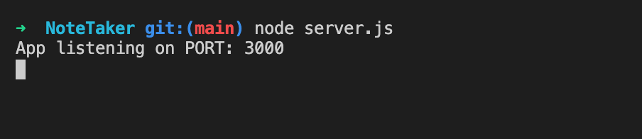
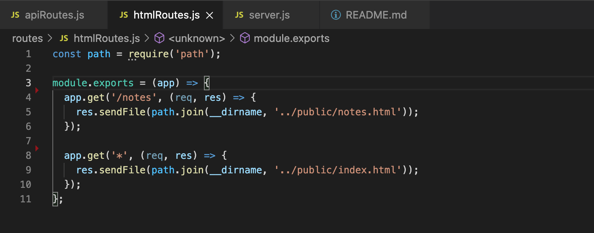
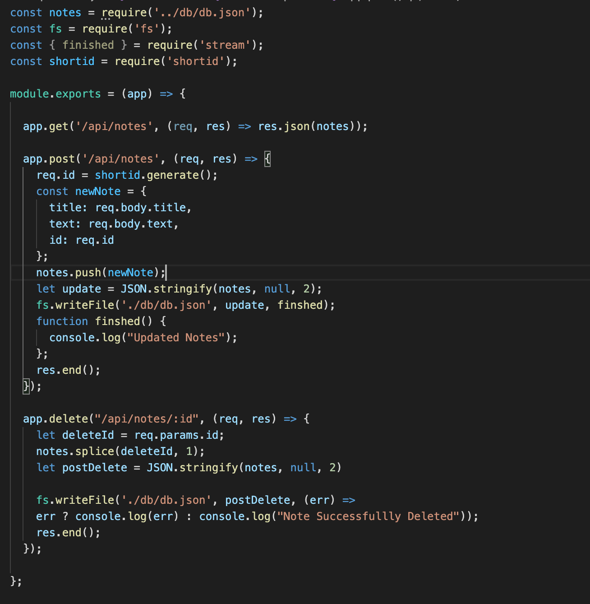
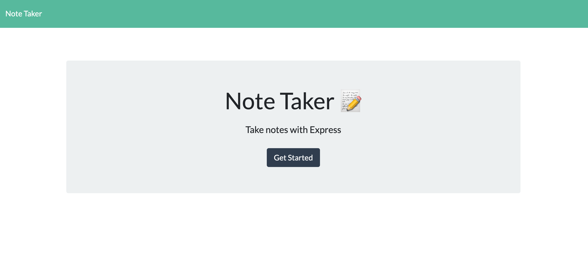
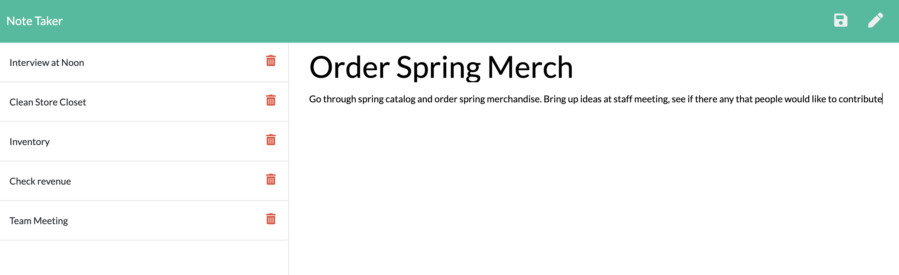
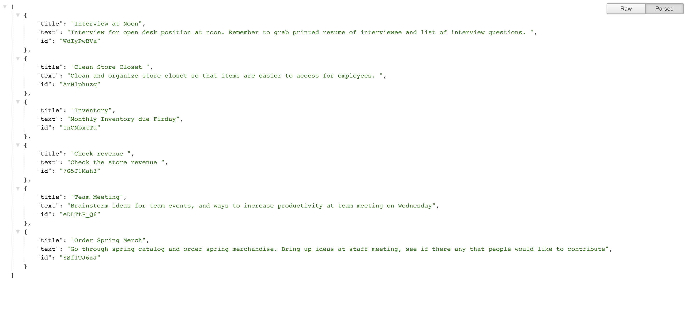

# Note Taker

  
## Description
The Note Taker application is perfect for a small business owner. They are easily able to write and save notes, so that they can organise their thoughts and keep track of tasks they need to complete throughout their busy day. 

This application, Note Taker can be used to write and save notes using Express.js back end functionality. This application saves and retrieves note data from a JSON file.

## Table of Contents

* [Deployed_Application](#Deployed_Application)
* [Usage](#Usage)
* [Mockup](#Mock-Up)
* [License](#License)
* [Questions](#Questions)
  
## Deployed_Application

To access this deployed application, visit the following link: [Note Taker](https://fathomless-journey-03162.herokuapp.com/)

## Usage

This application is ran through a server locally on Port 3000:

This application uses html and api routes, which connects the front end to the back end of the application.

This note taker application presents a user with a landing page and a link to a notes page. Once that link is selected, then the user is presented with a page of existing notes listed in the left-hand column, plus empty fields to enter a new note title and the note’s text in the right-hand column. When the user enters a new note title and the note details then a save icon will appear in the navigation bar at the top of the page. When the save icon is selected, then the new note is saved and appears dynamically in the left-hand column with the other existing notes. If an existing note in the list in the left-hand column is selected, then that note and its details appear in the right-hand column. If a User selects the write icon in the navigation at the top of the page then they are presented with empty fields to enter a new note title and the note’s text in the right-hand column. If the user selects the trash can text to a note, then that note is deleted.

### HTML Routes

* `GET /notes` returns the `notes.html` file

* `GET *` returns the `index.html` file

### API Routes 

* `GET /api/notes` reads the `db.json` file and returns all saved notes as JSON.

* `POST /api/notes` when new note is saved on the request body, it gets added to the `db.json` file, and then returns the new note to the client. Each note has a unique id, which is gained through utliziation of the npm package [shortid](https://www.npmjs.com/package/shortid)

`DELETE /api/notes/:id` recipes a query parameter containing the id of a note to delete. This done by reading the `db.json` file and when the note with a given `id` property is selected, it is removed.

All of this is read through the server.js file

## Mock-Up

The following image shows a mock-up of the generated HTML’s appearance:

### Note Taker Home

### Note Taker Note Page

### Note Taker API Data

## License

This application has a MIT License type. Please read more about permissions at [Choose A License](https://choosealicense.com/licenses/)

## Questions

Please reach out to me with any additional questions by contacting me.

* GitHub Profile: https://github.com/ross1jk
* My Email Address: Jacqueline.ross09@gmail.com